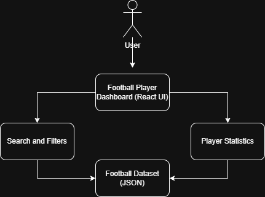

# Case Study: AI-Assisted Football Player Dashboard

## Executive Summary

This project demonstrates the use of AI-assisted software development to rapidly build an interactive football player analytics dashboard using IBM Bob. The objective was to evaluate how generative AI can accelerate application development while maintaining engineering best practices for documentation, architecture, and iterative improvement.

---

## Business Problem

Sports organizations and analysts rely on player performance data to make informed decisions. Traditional reporting often presents data in static tables, making it difficult to compare players or identify trends.

An interactive dashboard provides a more effective way to explore player statistics and supports faster decision-making.

---

## Project Objectives

- Learn AI-assisted software development using IBM Bob
- Build an interactive football analytics dashboard
- Practice prompt engineering for application development
- Establish a repeatable engineering workflow for future projects
- Document the complete software development lifecycle

---

## My Role

I completed the IBM Bob workshop while documenting the engineering process beyond the tutorial.

Responsibilities included:

- Prompt engineering
- Reviewing AI-generated code
- Validating application functionality
- Organizing project artifacts
- Creating technical documentation
- Identifying future enhancements

---

## Technologies Used

| Category | Technology |
|----------|------------|
| AI Development | IBM Bob |
| Frontend | React |
| UI Components | Carbon Design System |
| Version Control | Git / GitHub |
| IDE | Visual Studio Code |
| Documentation | Markdown |
| Data | Football player dataset |

---

## Solution Overview

The dashboard allows users to:

- View football player statistics
- Search players
- Filter player data
- Compare performance metrics
- Visualize information using charts and tables

---

## System Architecture



## Architecture Diagrams

This case study includes two completed architecture diagrams and one planned enhancement.

### Completed
- System Architecture
- Data Flow Diagram

### Planned
- Component Architecture Diagram

The system architecture explains the high-level relationship between the user, React dashboard, search/filter features, player statistics, and the football dataset.

The data flow diagram explains how the dataset is loaded, stored in application state, filtered by user interaction, and rendered through tables and charts.

---

## Development Process

1. Reviewed IBM Bob tutorial
2. Generated application with AI assistance
3. Verified generated code
4. Organized project structure
5. Created GitHub repository
6. Added engineering documentation
7. Planned future enhancements

---

## Challenges

- Learning AI-assisted development workflow
- Understanding generated React components
- Organizing the project into a professional portfolio structure
- Documenting architectural decisions

---

## Results

Successfully delivered:

- Functional dashboard
- Organized GitHub repository
- Engineering documentation
- Reusable project template for future case studies

---

## Lessons Learned

Key takeaways include:

- AI significantly accelerates initial application development.
- Engineering documentation remains essential even when code is AI-generated.
- Organizing projects consistently improves maintainability.
- AI-generated code should always be reviewed and validated.

---

## Future Enhancements

Potential improvements include:

- Advanced player comparison
- Team-level analytics
- Predictive performance models
- Natural language player search
- Cloud deployment
- Authentication
- REST API integration

---

## Leadership Reflection

This project reinforced that engineering leadership extends beyond writing code. Effective leaders establish repeatable processes, document technical decisions, validate AI-generated solutions, and create maintainable systems that other engineers can build upon.

---

## Repository Structure

```

case-studies/
01-football-dashboard/
├── src/
├── data/
├── screenshots/
├── architecture/
├── docs/
└── presentation/

```